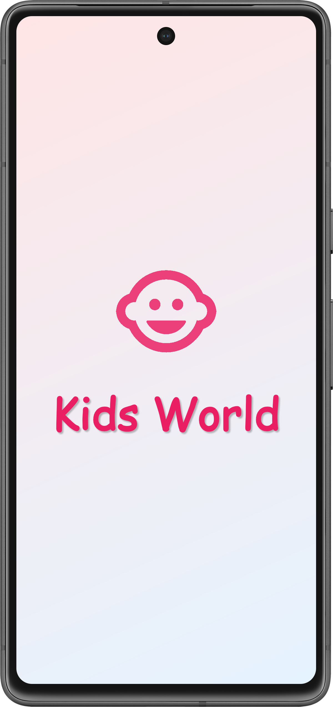
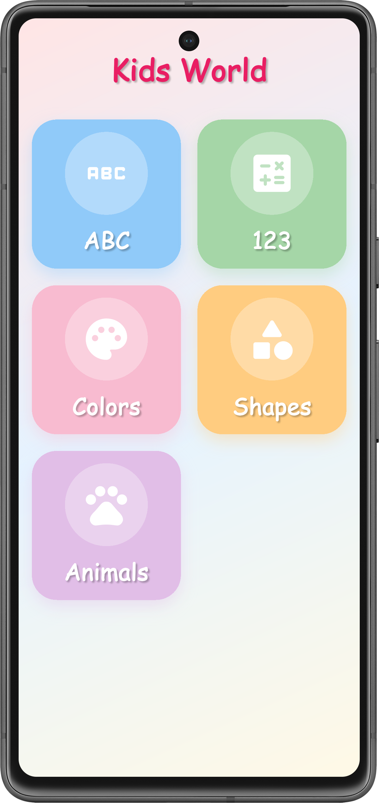
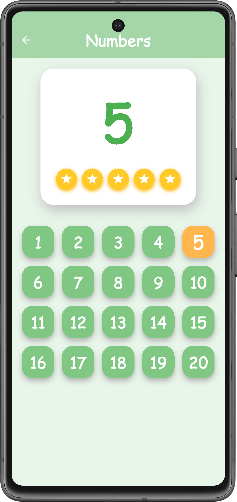
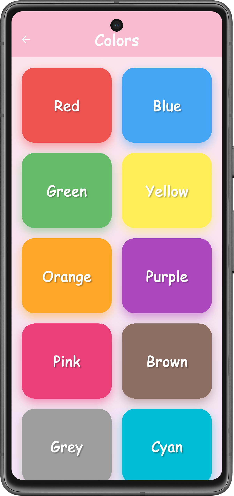
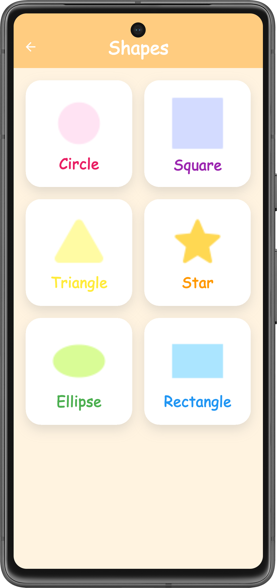
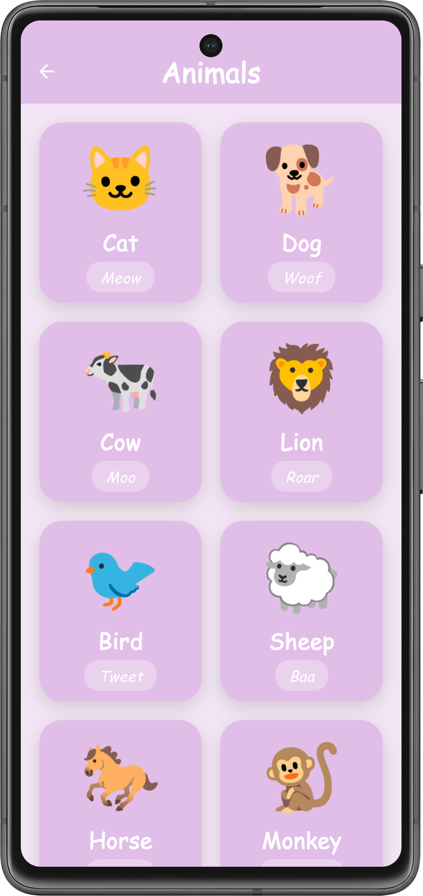

# 🎨 Kids World

Kids World هو تطبيق تعليمي للأطفال معمول بـ **Flutter**، بيقدّم محتوى بسيط وممتع لتعليم الأطفال من خلال **الصوت والصورة** 👶✨

---
## 📸 App Screenshots

### 🚀 Splash Screen


### 🏠 Home Screen


### 🅰️ Alphabet


### 🔢 Numbers


### 🎨 Colors


### 🔺 Shapes


### 🐾 Animals



## 📱 Features

- 🅰️ **ABC**
    - حروف إنجليزي
    - نطق كل حرف بصوته

- 🔢 **Numbers**
    - الأرقام من 1 إلى 10
    - نطق الأرقام بالصوت

- 🎨 **Colors**
    - تعليم الألوان
    - صوت لكل لون

- 🔺 **Shapes**
    - الأشكال الأساسية
    - نطق اسم كل شكل

- 🐾 **Animals**
    - صور حيوانات
    - صوت الحيوان + اسمه

---

## 🚀 App Screens

- **Splash Screen**
- **Home Screen** (Categories)
- Screen لكل Category فيها:
    - Data (اسم / صورة)
    - Sound (Audio)

---

## 🛠️ Built With

- **Flutter**
- **Dart**
- Assets:
    - Images
    - Audio files (mp3 / wav)

---

## 📂 Project Structure

```text
 
lib/
├── data/
│ ├── alphabet_data.dart
│ ├── animal_data.dart
│ ├── color_data.dart
│ ├── number_data.dart
│ └── shape_data.dart
│
├── models/
│ ├── alphabet_model.dart
│ ├── animal_model.dart
│ ├── color_model.dart
│ ├── number_model.dart
│ └── shape_model.dart
│
├── pages/
│ ├── splash_page.dart
│ ├── home_page.dart
│ ├── alphabet_page.dart
│ ├── numbers_page.dart
│ ├── colors_page.dart
│ ├── shapes_page.dart
│ └── animals_page.dart
│
├── widgets/
│ ├── build_activity_card.dart
│ ├── build_selected_alphabet.dart
│ ├── build_selected_number.dart
│ └── custom_app_bar.dart
│
└── main.dart

assets/
 ├── fonts/
 ├── images/
 └── sounds/

